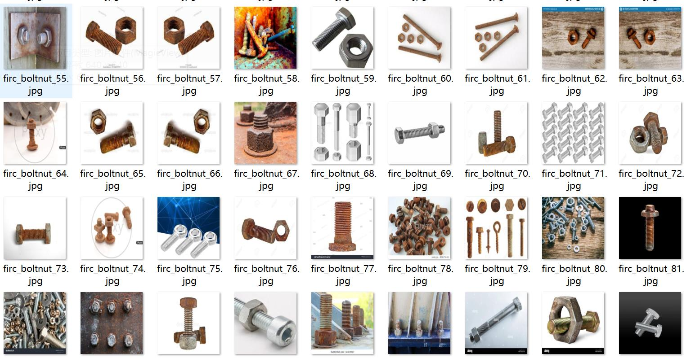
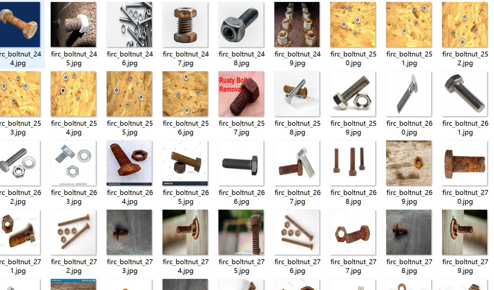
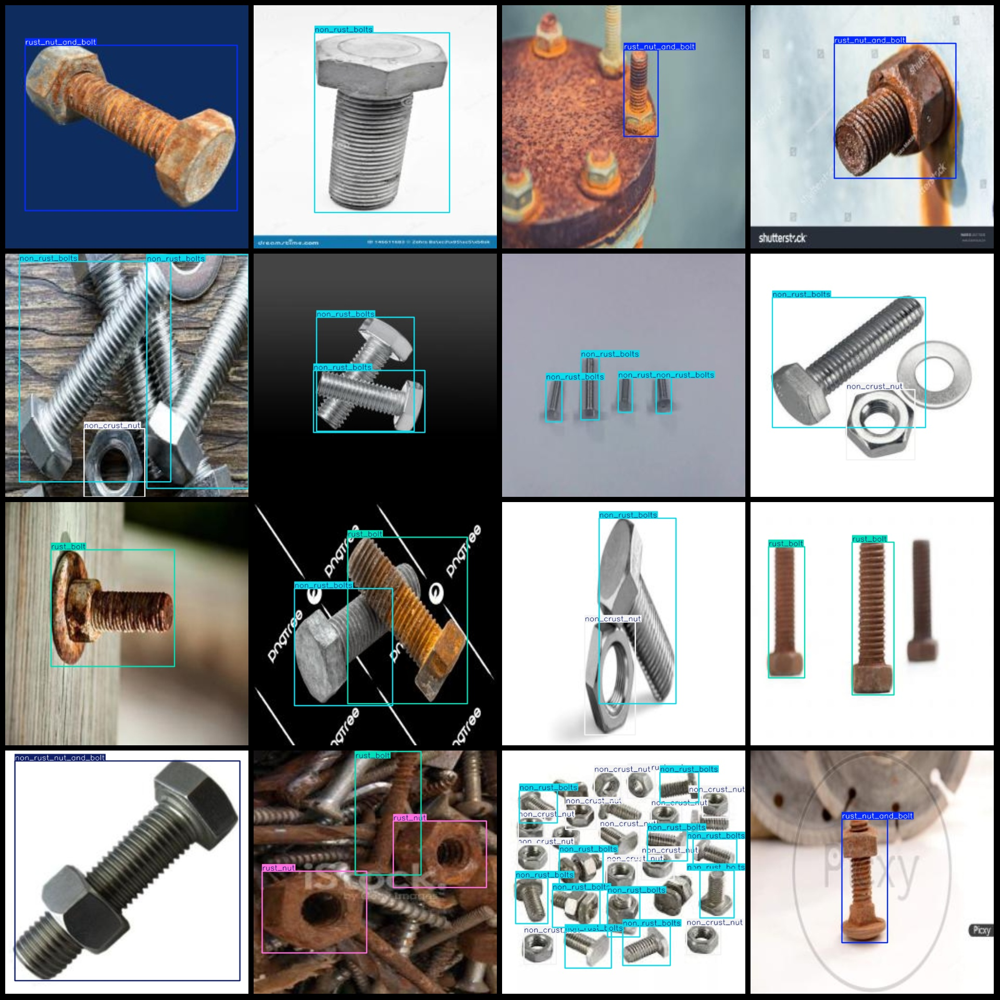
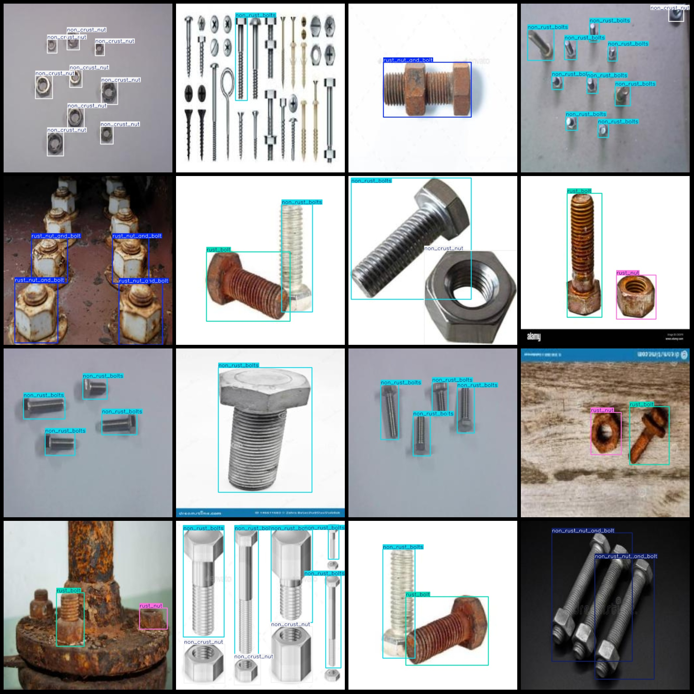

# Rust and Corrosion Detection Data Set in VOC+YOLO Format with 303 Images in 6 Categories

The dataset format is Pascal VOC format + YOLO format (the txt file does not contain the split path, only contains jpg images and corresponding VOC format xml files and yolo format txt files).
The number of images (jpg file count): 303
The number of XML files is 303.
The number of txt files is 303.
The number of categories is 6.
annotation class names: ["non_crust_nut", "non_rust_bolts", "non_rust_nut_and_bolt", "rust_bolt", "rust_nut", "rust_nut_and_bolt"]
The number of boxes annotated for each category:
The number of non-crust nuts (nuts without rust) is 291.
Non-rust bolts (non-rusted bolts): 350 boxes
Non-rust nuts and bolts combination: 41 boxes
The number of rust_bolt (rusted bolt) frames is 180.
The Rustnut (rust-nut) is a type of rusted metal nut. The number "81" in this context likely refers to the number of Rustnuts in a box.
The number of rust_nut_and_bolt frame is 80.
The total number of frames is 1023.
images per class:   
"non_crust_nut" is a term used in the automotive industry to describe a type of fastener, specifically a nut that does not have a rust-proof coating. It is often used in conjunction with a "non_crust_bolt" or similar fastener.

The number "74" in this context likely refers to the total number of non-rust-proof nuts (including bolts and nuts) that are present in an image or set of images. This information is important for various reasons, such as quality control, inventory management, and product design.

In summary, "non_crust_nut" refers to a type of fastener that does not have a rust-proof coating, and the number "74" indicates the total number of these fasteners present in an image or set of images.
Non-Rust Bolts (98)
The non-rusted nut and bolt combination has 17 images.
Rust Bolt images = 130  
Rust Nut images = 50
The rusty nut and bolt combination has occupied a total of 60 images.
Image Resolution: 640x640
Use annotation tool: labelImg.
Annotation rule: draw a rectangle around class.
Important Note: The dataset does not have a division into training, validation, and test sets.
Special Notice: This dataset does not guarantee the accuracy of models trained or weight files.
Preview image:
## Images

Here is a pay link on Stripe ( https://buy.stripe.com/3cs8yP7sY87d0vu9AB ). Please contact me lonlonago@foxmail.com after funding $89, and I will send you a complete data files , thank you!

